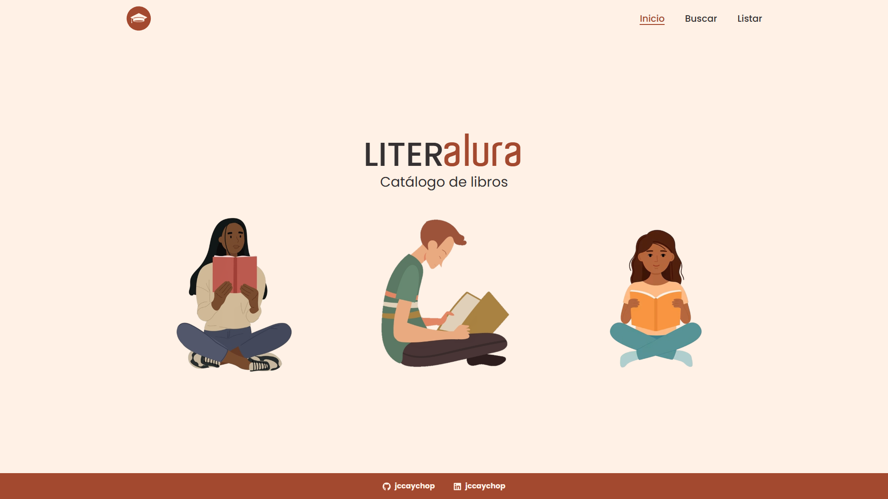
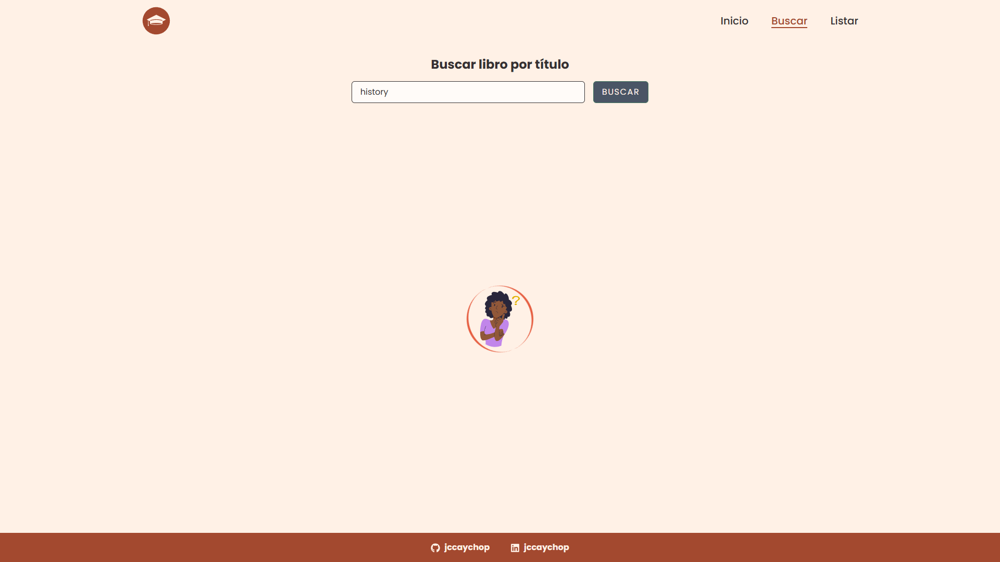
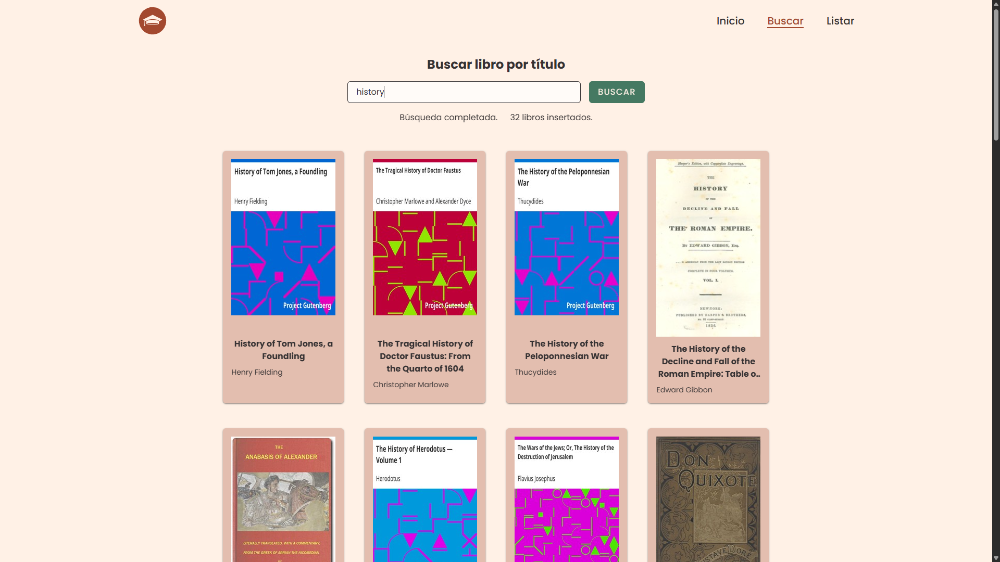
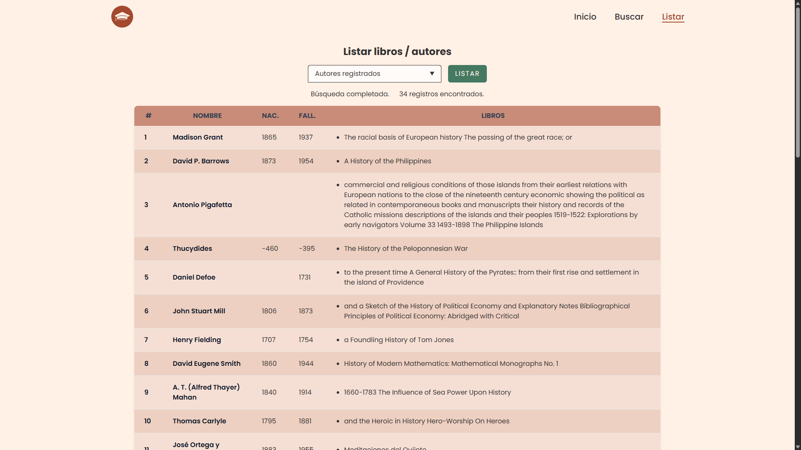
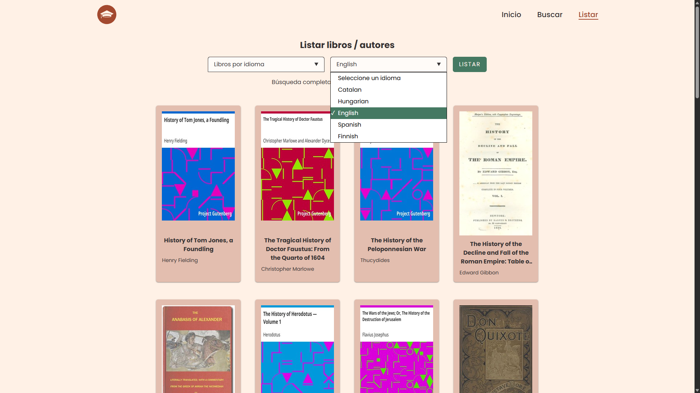
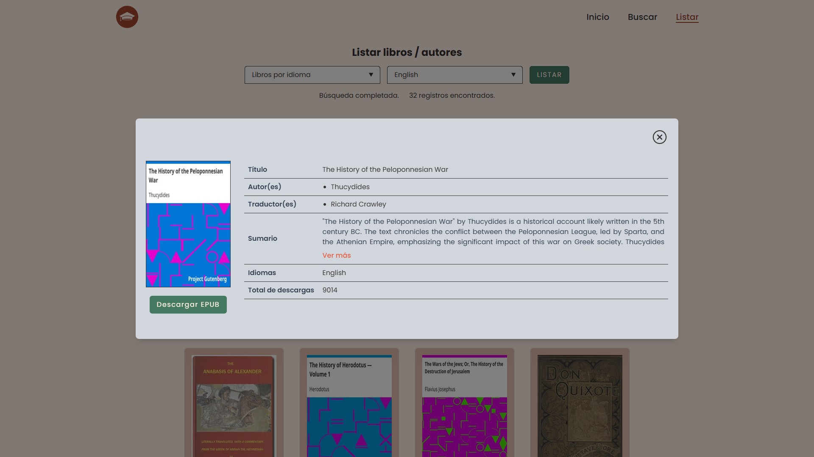
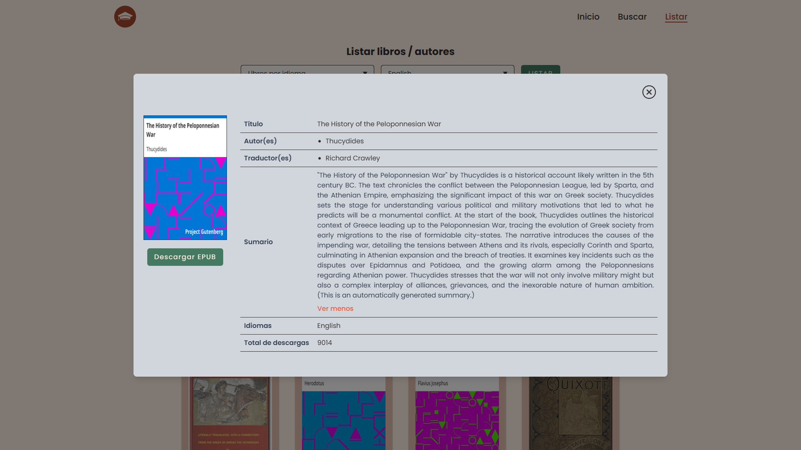
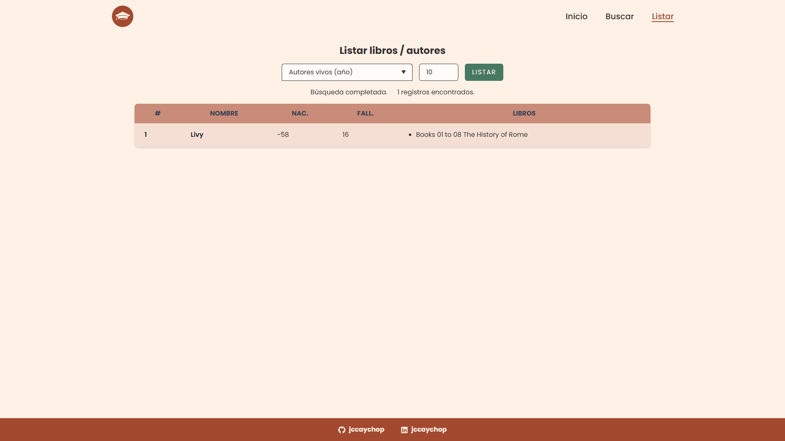
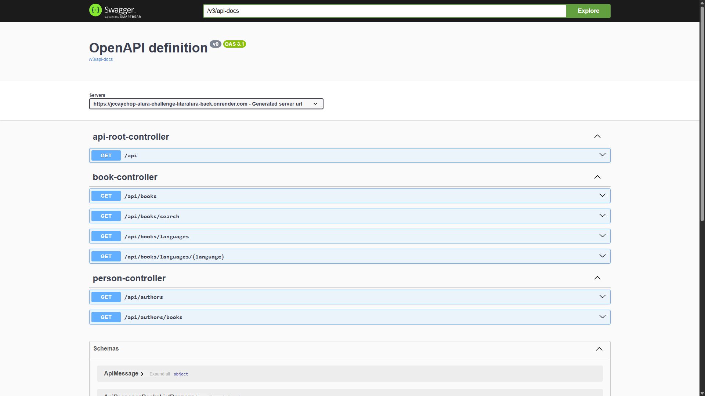

# CHALLENGE LITERALURA FRONT END

### Descripción

**Literalura** es una plataforma desarrollada como parte del **Alura Challenge - Oracle ONE**, que permite a los usuarios explorar libros clásicos de literatura, gestionar búsquedas, autores y libros favoritos.










Esta es la implementación **frontend**, desarrollada en React con TypeScript y Tailwind CSS. El frontend se comunica con un **backend propio** que intermedia y amplía las funcionalidades de la [API pública de Gutendex](https://gutendex.com/), permitiendo búsquedas enriquecidas, persistencia local de datos y manipulación más eficiente.

### 🔗 Proyecto Backend

Este proyecto se conecta a una API REST propia desarrollada en Java con Spring Boot, la cual se encarga de procesar las solicitudes del frontend, realizar consultas enriquecidas y exponer datos normalizados a partir de la API pública de Gutendex.

Puedes ver el repositorio del backend aquí:

👉 [jccaychop-alura-challenge-literalura-back](https://github.com/jccaychop/jccaychop-alura-challenge-literalura-back)

**PROYECTO BACKEND ONLINE**
Proyecto alojado en [Render.com](https://jccaychop-alura-challenge-literalura-back.onrender.com/)

Tener en cuenta que es un servicio gratuito, la aplicacion pasa a inactividad y toma su tiempo en volver a estar en servicio.



### 🚀 Funcionalidades

- 🔎 Búsqueda de libros por título, idioma y autor
- 🖋️ Listado y detalle de autores con sus libros
- 🌐 Filtro por idiomas disponibles
- 📘 Visualización de libros con sus formatos
- 📥 Persistencia local de libros/autores en base de datos vía backend propio
- 🎯 Interfaz moderna y adaptable (responsive)

### 🛠️ Tecnologías utilizadas

- [React 19](https://react.dev/)
- [TypeScript](https://www.typescriptlang.org/)
- [Vite](https://vitejs.dev/)
- [Tailwind CSS](https://tailwindcss.com/)
- [React Router DOM](https://reactrouter.com/en/main)
- [clsx](https://github.com/lukeed/clsx)
- **API propia en Java + Spring Boot (backend)**

### ⚙️ Instalación y ejecución

1. Clona el repositorio:

```bash
git clone https://github.com/jccaychop/jccaychop-alura-challenge-literalura-front
```

2. Instala las dependencias:

```
yarn install
```

3. Duplica el archivo `.env.template` y renómbralo como `.env`

4. Edita el archivo .env con tus valores locales:

```env
VITE_API_BASE_URL="http://192.168.18.12:8080"
```

5. Inicia la aplicación en desarrollo:

```
yarn run dev
```

4. Asegúrate de tener Node.js 18 o superior instalado, y que el backend esté corriendo localmente en el puerto correspondiente. El presente proyecto utiliza:
   `NODE 22.15.0 LTS`

### 🔗 APIs utilizadas

API propia (Java + Spring Boot) – para gestión de libros, autores y persistencia.

Gutendex API: https://gutendex.com/ – fuente original de datos públicos de libros.

### 📝 Licencia

Este proyecto está licenciado bajo los términos de la MIT License.
